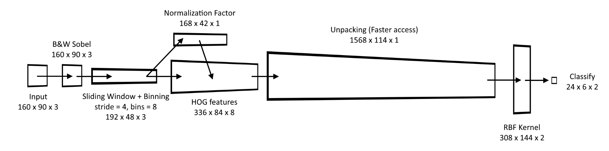

[](https://streamable.com/8q355)

# Face and Object Detection for VRChat

Implemented with a support vector machine (SVM) written in C++ and converted to HLSL to be used inside VRC on avatars. I have included a program that allows you to train your own detector and use it in game. Not only can you use it to detect faces, but other objects as well. **It's not very accurate in-game**, I'll cover this in a later section below.

## Overview


A 160x90 camera input is convereted into black and white with the gradient extracted. A 64x64 sliding window is applied with a stride of 4 pixels. HOG features are extracted by binning by the magnitude of the gradient according to the direction of the gradient into 8 bins. The features are normalized to account for differences in lighting and stretched out into a bigger texture to reduce the number of conditional moves and texture reads. The radial basis function (RBF) kernel is applied to each of the 1568 features per 64x64 image block and the support vectors. At the end, classification is done by doing the summation of all RBF calculations per 64x64 image block.

## Problems

1. A lot of false positives, since the input is 160x90 we lose a lot of detail. The detector loves to pick up random noise as faces.
2. The stride is too big, we lose a lot of detail.
3. Cameras are friends only, you can only show this to your friends.
4. SVMs needs to store data of the hyperplane that does the classification. So more training = more complex hyper plane = lag in game.

## Unity and VRChat Setup

1. Download the latest Face and Object Detection.unity in Release
2. Import into Unity
3. Look in the Prefabs folder
4. Put Face_Object Detect.prefab on your avatar
5. If you want to see what it's doing, put Preview.prefab on your avatar
6. Disable them by default and add a gesture to enable it.

The default detector is trained to look for faces.

## Training Setup

Ignore this if you just want to do use the default detector. This is for people who want to train their own detectors that to detect other objects.

#### Windows 10 64 bit machines
1. Download the latest VRC-SVM Train.exe in Release
#### Anything else
1. Compile the .cpp source code located in the C++ folder in this repo
  - **Requirements**
    - [dirent.h](https://github.com/tronkko/dirent)
    - [OpenCV 4.0.1](https://opencv.org/releases/)
2. Make sure the folders are setup the same as the following. Parent folder containing only two folders.


3. Run VRC-SVM Train.exe and tell it the folder containing the Positive and Negative training folders using  ```-d```
  - Example:```"VRC-SVM Train.exe" -d="D:\GitHub\Face-and-Object-Detection-in-Unity-Cg\C++\Training Data\Faces"```
  - ```-auto``` will do k-fold cross validation on the training set. **Warning: It crashes a lot if you use** ```-auto```
4. (Optional) To test a detector use ```-t``` and ```-fn``` to tell the program which detector you want to use.
  - Example:```"VRC-SVM Train.exe" -d="D:\GitHub\Face-and-Object-Detection-in-Unity-Cg\C++\Training Data\Faces" -t -fn="D:\GitHub\Face-and-Object-Detection-in-Unity-Cg\C++\out.yaml"```
5. Once training is done, drag the .yaml file into Unity. If you didn't pick a name, the default name is out.yaml. This file is created in the same directory as the .exe


6. Bake the data inside the .yaml file into an image by navigating to Tools -> SCRN -> Bake Support Vectors in Unity menus at the top
7. Drop the .yaml file into the Text Asset box and hit **Bake!** After a few seconds it should create two .asset files inside ```Assets\Face and Object Detection\Textures``` folder


8. Inside the Face_Object Detect.prefab, locate the materials called **Kernel** and **Classify** and place the new baked textures into the correct slots as shown in the picture above


9. Click on the .yaml file to view the text, look for a value after **sv_total**, this will be the new width of the kernel render texture.
10. Inside ```Assets\Face and Object Detection\Textures\RenderTex``` select **kernel** and **kernel Buffer** render textures.
11. Change the width of both render textures to **sv_total**
12. Done!

## Future Plans (Maybe)

Maybe use the depth buffer instead of RGB. Higher resolution, smaller stride, more detail.

## Contact

Contact me on Discord if you have any questions or suggestions: **SCRN#8008**
